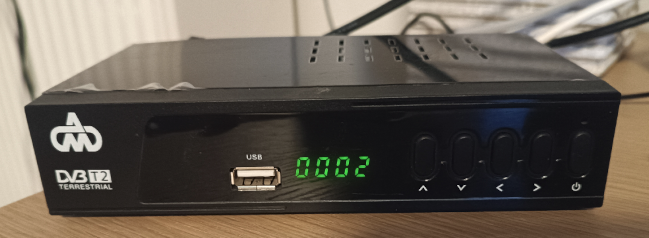

# Profiles for software remote controls for the irPlus Android application

Remote controls are unfortunately misplaced, permanently destroyed, damaged or lost. 

There are many profiles for software remotes for the most popular tv sets. 

On the other hand, such profiles for dvb-t boxes (mpeg decoders) are very rare or even not existent at all.

This repository, hosts remote control profiles for the irPlus Android application for my devices.

It goes without saying that your smartphone must have and ir capability (such as Redmi Note series)

## TV star t910 

The profile is [here](./Crypto%20tv%20star.irplus). You must import it int the [irplus](https://play.google.com/store/apps/details?id=net.binarymode.android.irplus&hl=el&gl=US) application

More details [here](https://ale3andro.gr/blog/2023/03/01/%cf%84%ce%b7%ce%bb%ce%b5%cf%87%ce%b5%ce%b9%cf%81%ce%b9%cf%83%cf%84%ce%ae%cf%81%ce%b9%ce%bf-%ce%b1%cf%80%ce%bf%ce%ba%cf%89%ce%b4%ce%b9%ce%ba%ce%bf%cf%80%ce%bf%ce%b9%ce%b7%cf%84%ce%ae-tv-star-%ce%ba/)

## DM dvb-t2 or Blow T2

The DM decoder is most probably a clone (aimed for the Greek market), of the Blow T2 dvb-t2 decoder.

The profile is [here](./dm.irplus). You must import it int the [irplus](https://play.google.com/store/apps/details?id=net.binarymode.android.irplus&hl=el&gl=US) application

