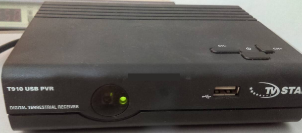
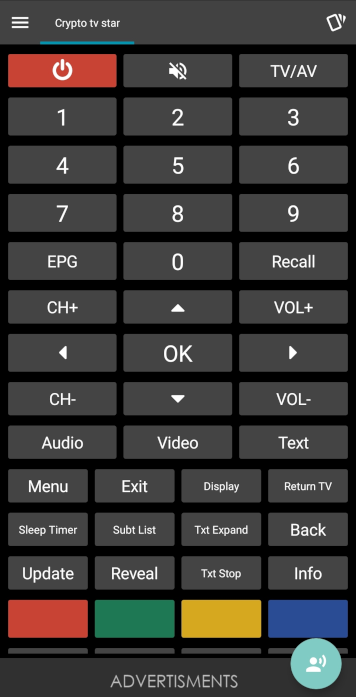

# tv star και Crypto software remote control mpeg4 decoder

Προφίλ για software τηλεχειριστήριο για αποκωδικοποιητές mpeg4 tv star και crypto.

Το αρχείο προφίλ πρέπει να γίνει εισαχθεί (import) στην εφαρμογή [irplus](https://play.google.com/store/apps/details?id=net.binarymode.android.irplus&hl=el&gl=US)

Εννοείται ότι το κινητό θα πρέπει να έχει ir blaster.

Περίσσότερα [εδώ](https://ale3andro.gr/blog/2023/03/01/%cf%84%ce%b7%ce%bb%ce%b5%cf%87%ce%b5%ce%b9%cf%81%ce%b9%cf%83%cf%84%ce%ae%cf%81%ce%b9%ce%bf-%ce%b1%cf%80%ce%bf%ce%ba%cf%89%ce%b4%ce%b9%ce%ba%ce%bf%cf%80%ce%bf%ce%b9%ce%b7%cf%84%ce%ae-tv-star-%ce%ba/)

